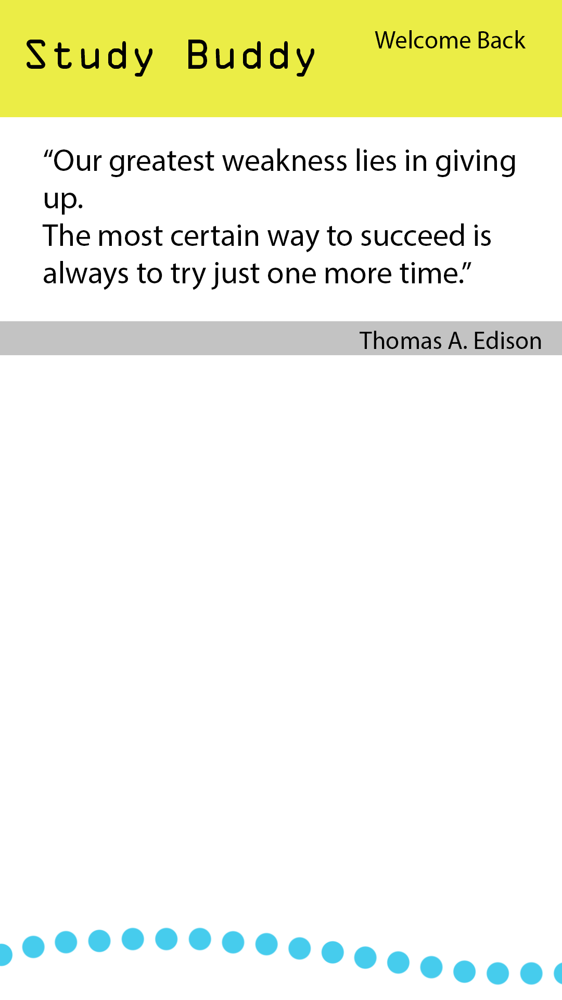

  

This hackathon was the first hackathon I've ever attended, and was during the Spring of 2015. This was a Women in Tech sponsored hackathon located on Maui island at a Hawaii STEM Conference. The StudyBuddy app is also the first mobile app I've developed, while being the first time I've used Unity and using Javascript (primarily because at the time, my background in programming was strictly all in Java), and coincidentally my first 'real' project (I differentiate the others as just practicing, or incomplete).
Unfortunately while some of my friends were also attending the STEM Conference, none of them were interested in participating or assisting me with the hackathon, so this was a solo project.

The StudyBuddy app is an app that is as the title suggests, an app to help you out with studying. I built this app while keeping in mind of how I memorize Spanish vocabulary; look at all the vocabulary words, then write out the English translation to the words. Then do the opposite. After a few attempts a day for a few days, the results are pretty astonishing. The only pain is having to consistently print out or write out my own worksheets everytime I want to do this study method.
So I built this app, which allows to do the same functionality but through timed multiple choice quizzes, because that's how my tests were done. You would start by creating your own quiz, inputting all the questions and corresponding correct answers, then saving and naming the quiz if you want to use them later (remedying my whole "having to remake the worksheets" issue). Wrong answers were generated by simply using the correct answers for other questions, so that you don't always see the same questions and the same wrong answers, as to not memorize the 'wrong' choices for each question. To assist in preventing that mentality, the questions that pop up are also going to be randomized so the user doesn't memorize the sequence of correct choices ("A, A, B, A, C, D, A, etc"), along with the correct answer being at a random choice.
While it didn't win the hackathon, I felt like it was a really great first complete project. If I were to go back to this, I think I would definitely rework the UI and do the programming in C#, and make quizzes more dynamic so users can customize what kind of quiz they want so it can be specified to work better for other subjects. A lot of the UI is done programmatically which is something I'd like to change as well.

You can see the project on [my github](https://github.com/SenderJosh/StudyBuddy-Unity-App).

