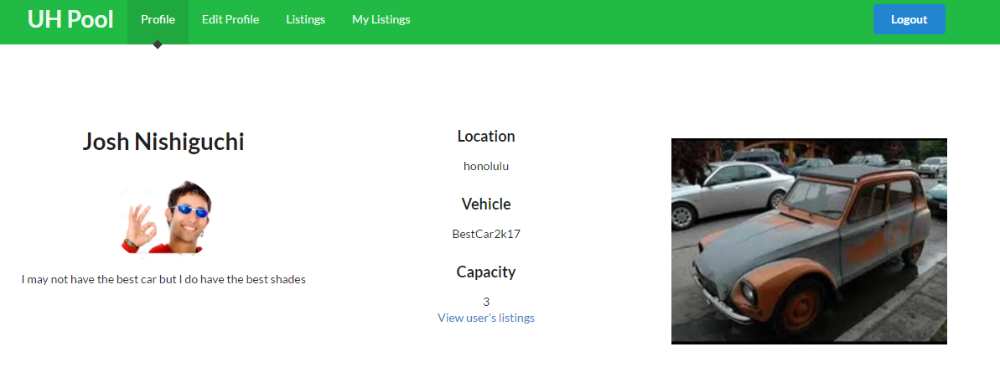

## Overview

The parking situation at the University of Hawaii at Manoa is not the best, and because of this, the University issues carpooling permits to students who apply, as well as standard permits. Carpooling permits are similar to the standard permits, but implies that they are going to be carpooling another student with them to save parking space. Not many students know about that permit, and even then it is difficult to find someone who is willing and nearby to work with your schedule.

UHPool is a carpooling app made using Meteor. The app is connected to the University of Hawaii CAS so only University of Hawaii students may use this app, and is linked to their UH accounts. With this app, students can connect to each other and carpool with each other to save gas and help remedy the busy-parking situation at UH Manoa, and other UH colleges.

Check the project out the official project documentation page <a href="https://uhpool.github.io/">here</a> for more information.

## My Part

My portion of the project involved making the necessary database schemas and the implementations for them that had to do with accepting carpools/cancelling carpools, makign new carpool listings, and viewing all carpool listings.

Throughout creating the pages and implementing the functionality, I've learned how to quickly debug Meteor applications through a checklist of common problems to help narrow down specific problems. My general checklist is: 

* Did I make a new file?
..* If so, are they imported?
* Are all my functions and variables spelled correctly?
* If I ctrl+z in this file, does it get fixed?
* What are my outputs?
..* Inputs?

Generally after going through each item in that list, or to the ones that are applicable, I would be able to figure out problems ranging from inserting in schemas, creation of schemas, initialization, and information that ended up missing from inserts. 

## My Thoughts

I still am not sure whether or not I truly enjoyed the experience with Meteor. Even though I have gained plenty of confidence throughout the development process of UHPool, I feel that my ideas for future projects will be spent with a different framework.
